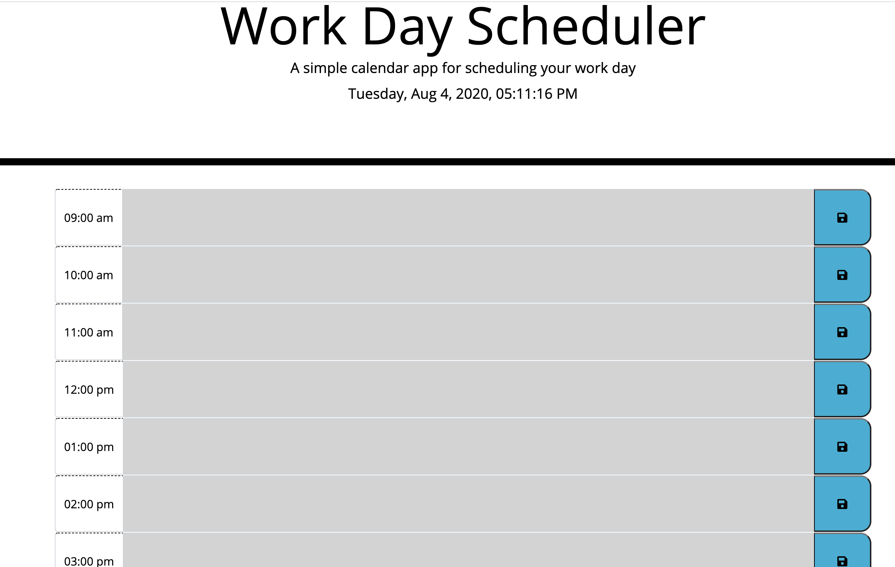
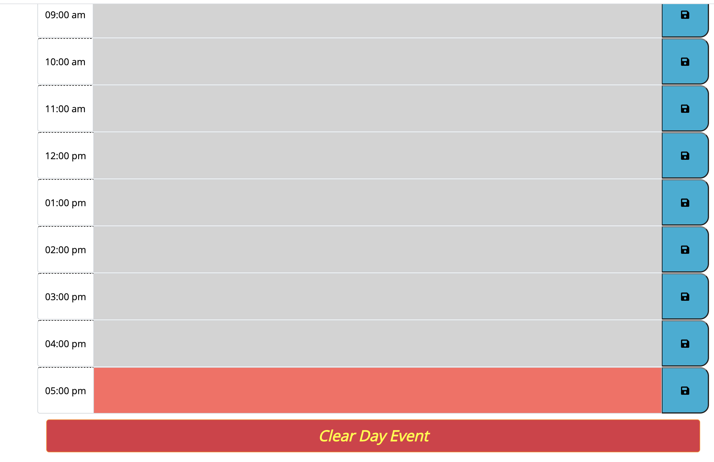
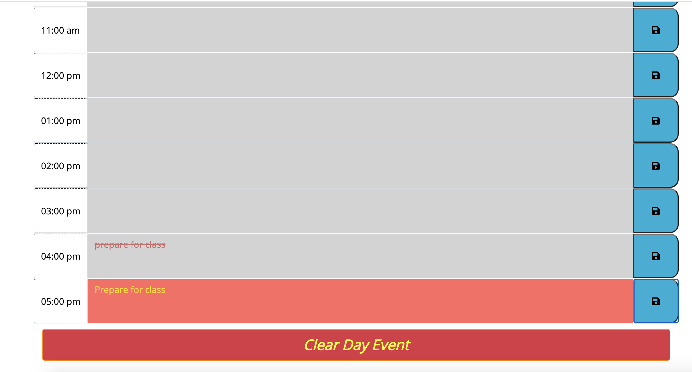
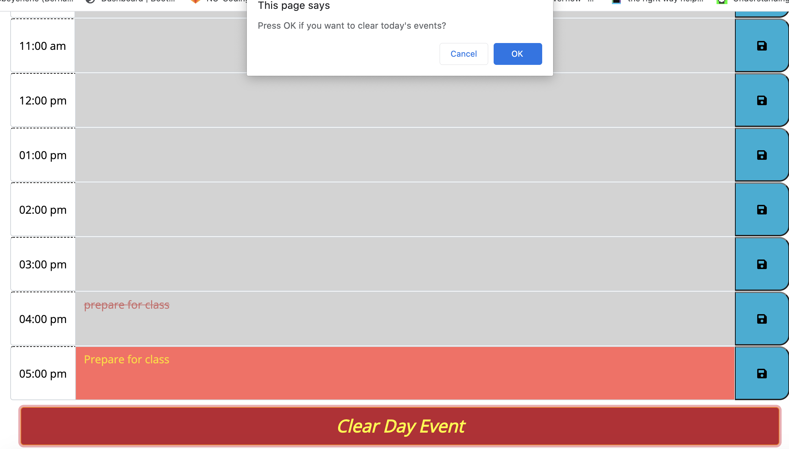

# Work-Day-Scheduler
This app is developed to allows a user to save important events of each hour of the day. In this app `index.html`, `style.css`, `script.js` files and screenshoot `images` directory are added. 

# Instruction
1. As the visual outlook shows in the header today's date and hours are included.
Down in the main body there is an input and a save button for eight hours of the the work day.  
 
 

 2. Once there is an event input it in that specified hour and save it by the button to the right.
 

 3. Once the work day is over the day's event can be cleared by the clear day bar at the bottom or clearing what ever hour and saving the change. To avoid acidental clear a prompt for a confirmiton is added.
 

 # Reminder
 The app will automatically line over the text and color grey the background once it is past current hour, else if it current hour the background color is red and future hours background color is green.

 https://bbeyenene.github.io/Work-Day-Scheduler/